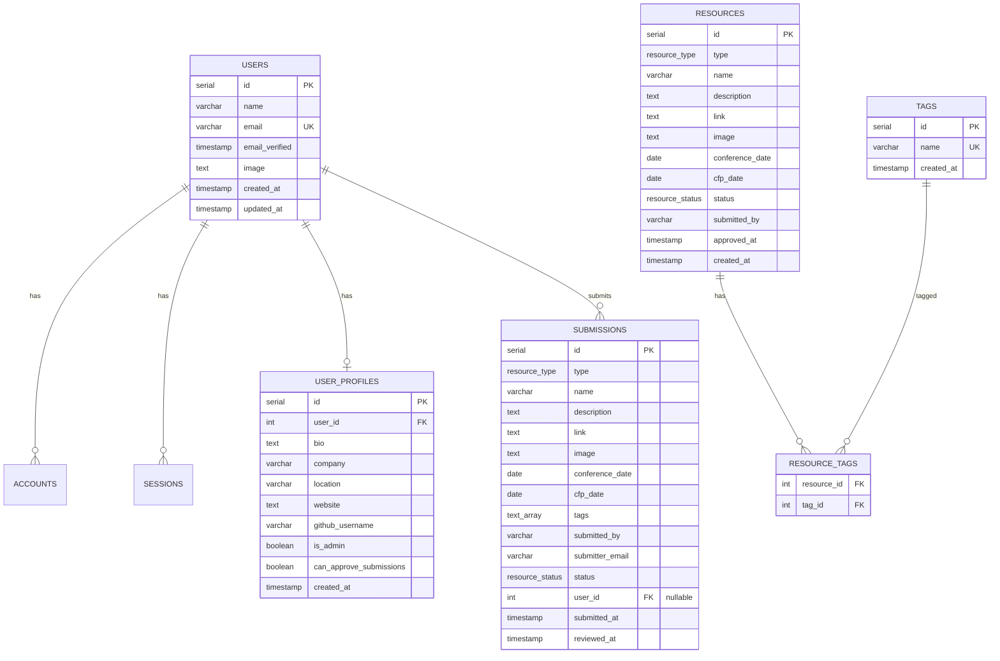

# Atlanta Tech Network - MVP Implementation Plan

**Created:** 2026-01-02
**Branch:** New feature branch
**Database:** neon-pink-umbrella (Vercel Postgres/Neon)

## Overview

Building a community-driven platform for Atlanta's tech ecosystem with:
- Public resource submissions (no login required)
- Admin-only authentication for moderation
- Security measures against bots and bad actors
- Manual approval queue for all submissions

## Architecture Decision: Option A - Admin-Only Auth

### User Flows


### Data Flow


### Database Schema



## Implementation Phases

### Phase 1: Upgrade Dependencies ⬆️

**Objective:** Modernize dependencies to avoid tech debt

**Tasks:**
- [ ] Upgrade `zod` from 3.25.67 → 4.3.4
- [ ] Upgrade `@hookform/resolvers` from 3.10.0 → 5.2.2
- [ ] Test existing code for breaking changes
- [ ] Fix any Zod v4 migration issues
  - Check `.default()` usage
  - Verify error message handling
  - Test type inference

**Success Criteria:**
- All tests pass with Zod v4
- No TypeScript errors
- Forms validate correctly

---

### Phase 2: Security & Validation 🔒

**Objective:** Protect against bots, spam, and attacks

#### 2.1 Input Validation (Zod v4)

**Create schemas for:**
```typescript
// Submission validation
const submissionSchema = z.object({
  type: z.enum(['meetup', 'conference', 'online', 'tech-hub']),
  name: z.string().min(3).max(255),
  description: z.string().min(20).max(2000),
  link: z.string().url().startsWith('https://'),
  image: z.string().url().optional(),
  conferenceDate: z.string().date().optional(),
  cfpDate: z.string().date().optional(),
  tags: z.array(z.string()).min(1).max(10),
  submittedBy: z.string().min(2).max(255),
  submitterEmail: z.string().email().optional(),
  // Honeypot field
  website: z.string().max(0), // Must be empty
})
```

**Files to create/update:**
- `lib/validations/submission.ts` - Zod schemas
- `app/api/submissions/route.ts` - Apply validation

#### 2.2 Rate Limiting

**Install packages:**
```bash
bun add @upstash/ratelimit @upstash/redis
```

**Configuration:**
- 3 submissions per hour per IP
- Returns 429 Too Many Requests when exceeded
- Use Upstash Redis for distributed rate limiting

**Files to create:**
- `lib/rate-limit.ts` - Rate limiter setup
- Update `app/api/submissions/route.ts` - Apply rate limiting

#### 2.3 Honeypot Field

**Add hidden field to forms:**
```typescript
<input
  type="text"
  name="website"
  className="hidden"
  tabIndex={-1}
  autoComplete="off"
/>
```

**Validation:**
- If field is filled → Silent rejection
- Bots typically fill all fields
- Humans never see/fill this field

**Files to update:**
- `components/submit-resource-section.tsx` - Add honeypot
- `app/api/submissions/route.ts` - Check honeypot

#### 2.4 SQL Injection Protection

**Already implemented via:**
- ✅ `@vercel/postgres` with parameterized queries
- ✅ No string concatenation in SQL

**Verify all queries use:**
```typescript
await sql`SELECT * FROM submissions WHERE id = ${id}`
// NOT: await sql`SELECT * FROM submissions WHERE id = '${id}'`
```

**Success Criteria:**
- Zod validation catches invalid inputs
- Rate limiting blocks rapid submissions
- Honeypot catches bots
- No SQL injection vulnerabilities

---

### Phase 3: Admin-Only Authentication 🔐

**Objective:** Secure admin panel while keeping submissions public

#### 3.1 Public Submission Flow

**Update submission form:**
- Remove any auth checks
- Collect name and optional email
- No login required
- All submissions → `pending` status

**Files to update:**
- `components/submit-resource-section.tsx` - Remove auth
- `app/api/submissions/route.ts` - Allow anonymous

#### 3.2 Admin Authentication

**OAuth Providers:**
- GitHub OAuth
- Google OAuth

**Configuration:**
```env
AUTH_SECRET=<generated>
AUTH_URL=https://atl-tech-network.vercel.app
AUTH_GITHUB_ID=<from GitHub>
AUTH_GITHUB_SECRET=<from GitHub>
AUTH_GOOGLE_ID=<from Google>
AUTH_GOOGLE_SECRET=<from Google>
```

**Setup OAuth Apps:**

**GitHub:**
1. https://github.com/settings/developers
2. New OAuth App
3. Callback: `https://atl-tech-network.vercel.app/api/auth/callback/github`

**Google:**
1. https://console.cloud.google.com/apis/credentials
2. OAuth client ID
3. Callback: `https://atl-tech-network.vercel.app/api/auth/callback/google`

#### 3.3 Navigation Updates

**Add user navigation:**
- `<UserNav />` component in header
- Shows "Sign In" for logged-out users
- Shows avatar + dropdown for logged-in users
- "Admin Panel" link only for admins

**Files to update:**
- `components/navigation.tsx` - Add UserNav

#### 3.4 Route Protection

**Create middleware:**
```typescript
// middleware.ts
export { auth as middleware } from "@/auth"

export const config = {
  matcher: ["/admin/:path*"]
}
```

**Files to create:**
- `middleware.ts` - Protect admin routes

**Success Criteria:**
- Public users can submit without login
- Only authenticated users can access `/admin`
- OAuth login works for GitHub + Google
- Admin status properly checked

---

### Phase 4: Admin Dashboard 👨‍💼

**Objective:** Create admin interface for reviewing submissions

#### 4.1 Admin Dashboard Layout

**Create pages:**
- `/admin` - Dashboard overview
- `/admin/submissions` - Review queue

**Features:**
- List all pending submissions
- View submission details
- Approve/reject buttons
- Show submission stats

**Files to create:**
- `app/admin/page.tsx` - Dashboard
- `app/admin/submissions/page.tsx` - Review queue
- `app/admin/layout.tsx` - Admin layout
- `components/admin/submission-card.tsx` - Submission display
- `components/admin/submission-actions.tsx` - Approve/reject

#### 4.2 Approval Flow

**Approve submission:**
1. Create entry in `resources` table (status=approved)
2. Link tags via `resource_tags`
3. Update submission status to "approved"
4. Set `approved_at` timestamp

**Reject submission:**
1. Update submission status to "rejected"
2. Set `reviewed_at` timestamp
3. Optional: Add rejection reason

**API endpoints:**
```typescript
PATCH /api/admin/submissions/:id/approve
PATCH /api/admin/submissions/:id/reject
GET /api/admin/submissions?status=pending
GET /api/admin/stats
```

**Files to create:**
- `app/api/admin/submissions/[id]/approve/route.ts`
- `app/api/admin/submissions/[id]/reject/route.ts`
- `app/api/admin/stats/route.ts`

#### 4.3 Admin User Management

**Set admin users:**
```sql
-- Mark user as admin by email
UPDATE user_profiles
SET is_admin = true, can_approve_submissions = true
WHERE user_id = (SELECT id FROM users WHERE email = 'your-email@example.com');
```

**Check admin status in UI:**
```typescript
const session = await auth()
const profile = await getUserProfile(session.user.id)
if (!profile?.is_admin) {
  redirect('/') // Not authorized
}
```

**Success Criteria:**
- Admins can view pending submissions
- Approve moves to resources table (visible on site)
- Reject updates status only
- Non-admins cannot access admin panel

---

### Phase 5: Deploy MVP 🚀

**Objective:** Launch to production

#### 5.1 Local Testing

**Test cases:**
- [ ] Public submission without login
- [ ] Rate limiting (submit 4 times quickly)
- [ ] Honeypot (fill hidden field)
- [ ] Invalid data (Zod validation)
- [ ] Admin login (GitHub)
- [ ] Admin login (Google)
- [ ] View pending submissions
- [ ] Approve submission → appears on site
- [ ] Reject submission → stays hidden
- [ ] Non-admin user cannot access /admin

#### 5.2 Database Migrations

**Run on Vercel Postgres:**
1. `db/migrations/001_initial_schema.sql` - Core tables
2. `db/seed.sql` - Initial tags
3. `db/migrations/002_auth_schema.sql` - Auth tables

**Via Vercel Dashboard:**
- Storage → neon-pink-umbrella → Query tab
- Copy/paste each migration
- Verify tables created

#### 5.3 Environment Variables

**Add to Vercel:**
```
POSTGRES_URL=<auto-populated>
AUTH_SECRET=<generate: openssl rand -base64 32>
AUTH_URL=https://atl-tech-network.vercel.app
AUTH_GITHUB_ID=<from GitHub OAuth>
AUTH_GITHUB_SECRET=<from GitHub OAuth>
AUTH_GOOGLE_ID=<from Google OAuth>
AUTH_GOOGLE_SECRET=<from Google OAuth>
```

**Update OAuth redirect URLs:**
- GitHub: Add production callback
- Google: Add production callback

#### 5.4 Deploy

**Steps:**
1. Commit all changes to branch
2. Push to GitHub
3. Create pull request
4. Review changes
5. Merge to `main`
6. Vercel auto-deploys
7. Test production site
8. Mark yourself as admin in database

**Success Criteria:**
- Site loads on production URL
- Submissions work without login
- OAuth login works for admins
- Admin can approve/reject submissions
- Approved submissions appear on site

---

## Security Measures Summary


### Protection Layers

| Layer | Protection | Implementation |
|-------|-----------|----------------|
| 1️⃣ Honeypot | Catches bots | Hidden form field |
| 2️⃣ Rate Limiting | Prevents spam/DDoS | 3 submissions/hour per IP |
| 3️⃣ Input Validation | Prevents bad data | Zod v4 schemas |
| 4️⃣ SQL Injection | Database security | Parameterized queries |
| 5️⃣ Manual Review | Final check | Admin approval queue |

---

## Deferred Features 📌

**Post-MVP enhancements:**

1. **Meetup API Integration**
   - Auto-fetch events from Meetup.com
   - Sync with Atlanta-area tech meetups
   - Daily cron job to update

2. **Email Verification**
   - Send verification link if email provided
   - Only verified submissions go to review queue

3. **Advanced Bot Protection**
   - Google reCAPTCHA v3 (invisible)
   - Or Cloudflare Turnstile (privacy-friendly)

4. **Email Notifications**
   - Notify admins of new submissions
   - Notify submitters when approved/rejected

5. **Analytics Dashboard**
   - Submission trends
   - Popular tags
   - User engagement metrics

6. **Bulk Operations**
   - Approve/reject multiple submissions
   - Tag management
   - Resource management

---

## File Structure

```
atl-tech-network/
├── app/
│   ├── admin/
│   │   ├── layout.tsx           # Admin layout
│   │   ├── page.tsx             # Dashboard overview
│   │   └── submissions/
│   │       └── page.tsx         # Review queue
│   ├── api/
│   │   ├── admin/
│   │   │   └── submissions/
│   │   │       ├── [id]/
│   │   │       │   ├── approve/route.ts
│   │   │       │   └── reject/route.ts
│   │   │       └── route.ts     # List submissions
│   │   ├── auth/
│   │   │   └── [...nextauth]/route.ts
│   │   └── submissions/
│   │       └── route.ts         # Public submissions
│   ├── auth/
│   │   └── signin/page.tsx      # Sign in page
│   └── layout.tsx               # Root layout (with SessionProvider)
├── components/
│   ├── admin/
│   │   ├── submission-card.tsx
│   │   └── submission-actions.tsx
│   ├── auth/
│   │   ├── session-provider.tsx
│   │   └── user-nav.tsx
│   └── ui/                      # Shadcn components
├── db/
│   ├── migrations/
│   │   ├── 001_initial_schema.sql
│   │   └── 002_auth_schema.sql
│   ├── schema.sql
│   └── seed.sql
├── docs/
│   └── MVP_PLAN.md              # This file
├── lib/
│   ├── validations/
│   │   └── submission.ts        # Zod schemas
│   ├── db.ts                    # Database helpers
│   └── rate-limit.ts            # Rate limiting
├── auth.config.ts               # Auth.js config
├── auth.ts                      # Auth.js setup
├── middleware.ts                # Route protection
├── .env                         # Local environment
└── README_AUTH.md               # Auth setup guide
```

---

## Quick Reference

### Run Migrations
```bash
# Via Vercel Dashboard
Storage → neon-pink-umbrella → Query → Paste SQL

# Via CLI (if psql installed)
psql $POSTGRES_URL < db/migrations/001_initial_schema.sql
psql $POSTGRES_URL < db/seed.sql
psql $POSTGRES_URL < db/migrations/002_auth_schema.sql
```

### Set Admin User
```sql
UPDATE user_profiles
SET is_admin = true, can_approve_submissions = true
WHERE user_id = (SELECT id FROM users WHERE email = 'your-email@example.com');
```

### Generate Auth Secret
```bash
openssl rand -base64 32
```

### Test Rate Limiting
```bash
# Submit 4 times quickly - 4th should fail with 429
for i in {1..4}; do
  curl -X POST http://localhost:3000/api/submissions \
    -H "Content-Type: application/json" \
    -d '{"name":"Test","description":"..."}';
done
```

---

## Success Metrics

**MVP is successful when:**
- ✅ Public users can submit resources without login
- ✅ Bot submissions are blocked (honeypot + rate limit)
- ✅ Invalid data is rejected (Zod validation)
- ✅ No SQL injection vulnerabilities
- ✅ Admins can login with GitHub/Google
- ✅ Admins can approve/reject submissions
- ✅ Approved resources appear on site immediately
- ✅ Zero downtime during submission surge
- ✅ Site loads in < 2 seconds
- ✅ Mobile responsive on all pages

---

**Last Updated:** 2026-01-02
**Status:** Ready for implementation
**Estimated Timeline:** 2-3 days
